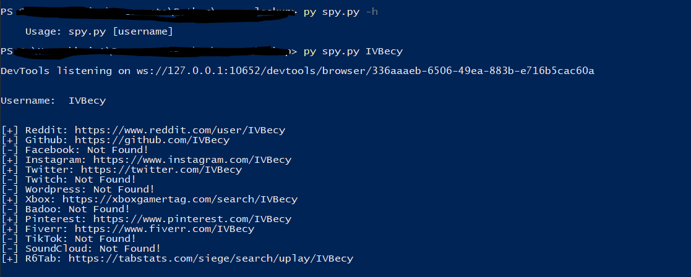

# Username Lookup

 #### This is a program that looks up, one specific username on many websites.
 ### Preview
 
 
 ### Usage: ```spy.py [username]```
 
 ## Modules:
 - Selenium ```pip install selenium```
 - time
 - sys
 
 ## Sites:
 ```python
 sites = {
    "Reddit": "https://www.reddit.com/user/",
    "Github": "https://github.com/",
    "Facebook": "https://www.facebook.com/",
    "Instagram": "https://www.instagram.com/",
    "Twitter": "https://twitter.com/",
    "Twitch": "https://www.twitch.tv/",
    "Wordpress": "https://profiles.wordpress.org/",
    "Xbox": "https://xboxgamertag.com/search/",
    "Badoo": "https://badoo.com/",
    "Pinterest": "https://www.pinterest.com/",
    "Fiverr": "https://www.fiverr.com/",
    "TikTok": "https://www.tiktok.com/@",
    "SoundCloud": "https://soundcloud.com/",
    "R6Tab": "https://tabstats.com/siege/search/uplay/",
}
 ```
