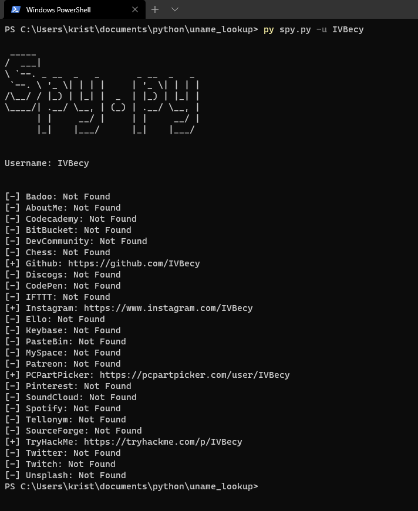

# Username Lookup

 #### This is a program that looks up, one specific username on many websites.
 ### Preview
 
 
 ### Usage: ```spy.py [username]```
 
 ## Modules:
Just type into your console `pip install -r requirements.txt`
 
 ## Sites:
 You can add sites in the config.json file!
 ```python
sites = {
  "AboutMe": "https://about.me/",
  "Badoo": "https://badoo.com/",
  "CodePen": "https://codepen.io/",
  "DevCommunity": "https://dev.to/",
  "Discogs": "https://www.discogs.com/user/",
  "Ello": "https://ello.co/",
  "Github": "https://github.com/",
  "IFTT": "https://www.ifttt.com/p/",
  "Instagram": "https://www.instagram.com/",
  "Keybase": "https://keybase.io/",
  "MySpace": "https://myspace.com/",
  "PasteBin": "https://pastebin.com/u/",
  "Patreon": "https://www.patreon.com/",
  "PCPartPicker": "https://pcpartpicker.com/user/",
  "Pinterest": "https://www.pinterest.com/",
  "Reddit": "https://www.reddit.com/user/",
  "SoundCloud": "https://soundcloud.com/",
  "Spotify": "https://open.spotify.com/user/",
  "Tellonym": "https://tellonym.me/",
  "TryHackMe": "https://tryhackme.com/p/",
  "Twitch": "https://m.twitch.tv/",
  "Twitter": "https://mobile.twitter.com/",
  "Wordpress": "https://profiles.wordpress.org/",
  "Xbox": "https://xboxgamertag.com/search/",
  "Youtube": "https://www.youtube.com/",
}
 ```

## Testing
This project was tested on Windows and Ubuntu with Python3.8, Python3.6 and pypy3
